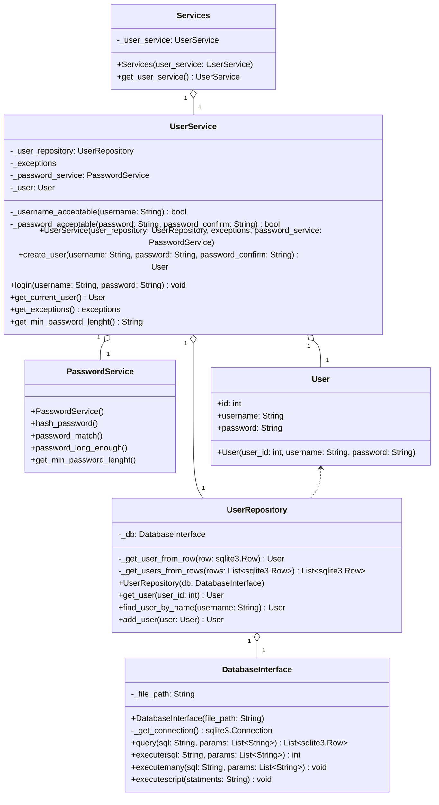

```mermaid
classDiagram
    Services "1" o-- "1" UserService
    UserService "1" o-- "1" PasswordService
    UserService "1" o-- "1" User
    UserService "1" o-- "1" UserRepository
    UserRepository "1" o-- "1" DatabaseInterface
    User <.. UserRepository
    class Services{
        -_user_service: UserService
        +Services(user_service: UserService)
        +get_user_service() UserService
    }
    class UserService{
        -_user_repository: UserRepository
        -_exceptions
        -_password_service: PasswordService
        -_user: User
        -_username_acceptable(username: String) bool
        -_password_acceptable(password: String, password_confirm: String) bool
        +UserService(user_repository: UserRepository, exceptions, password_service: PasswordService)
        +create_user(username: String, password: String, password_confirm: String) User
        +login(username: String, password: String) void
        +get_current_user() User
        +get_exceptions() exceptions
        +get_min_password_lenght() String
    }
    class PasswordService{
        +PasswordService()
        +hash_password()
        +password_match()
        +password_long_enough()
        +get_min_password_lenght()
    }
    class User{
        +id: int
        +username: String
        +password: String
        +User(user_id: int, username: String, password: String)
    }
    class UserRepository{
        -_db: DatabaseInterface
        -_get_user_from_row(row: sqlite3.Row) User
        -_get_users_from_rows(rows: List~sqlite3.Row~) List~sqlite3.Row~ 
        +UserRepository(db: DatabaseInterface)
        +get_user(user_id: int) User
        +find_user_by_name(username: String) User
        +add_user(user: User) User

    }
    class DatabaseInterface{
        -_file_path: String
        +DatabaseInterface(file_path: String)        
        -_get_connection() sqlite3.Connection
        +query(sql: String, params: List~String~) List~sqlite3.Row~
        +execute(sql: String, params: List~String~) int
        +executemany(sql: String, params: List~String~) void
        +executescript(statments: String) void
    }
```