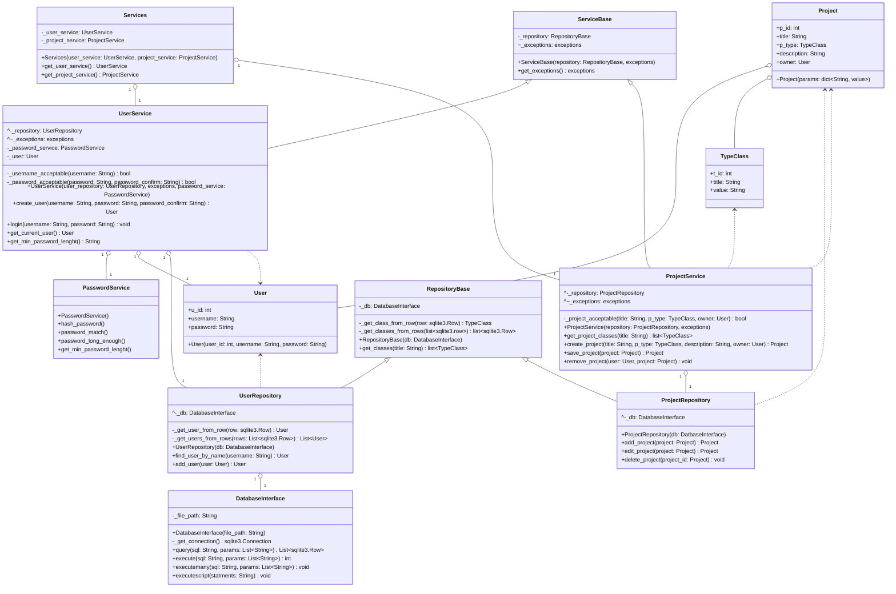

# Arrkkitehtuurin kuvaus

## Rakenne

Ohjelma koostuu neljästä tasosta:

1. Käyttöliittymä (ui-pakkaus)
2. Palvelu (services-pakkaus)
3. Varastointi (repositories-pakkaus)
4. Tietokanta (database-pakkaus)

Lisäksi tiedon siirtoon ja käsittelyyn käytetään luokkia entities-pakkauksesta. Jokainen taso käyttää yhtä alempaa tasoa toimituksissaan.

## Sovelluslogiikka

Sovelluksen loogisesta toiminnasta vastaavat luokat Services, ServiceBase, UserService, ProjectService ja PasswordService. UserService ja ProjectService perivät luokan ServiceBase, jossa on niiden jakamat attribuutit ja metodit. 

Services-luokkalle ujutetaan konstruktorin kautta UserService- ja ProjeService-oliot. Services-luokka tarjoaa rajapinnan kutsua sisältämiensä palvelujen metodeja kauttaan. 

UserService-luokkalle ujutetaan konstruktorin kautta PasswordService-luokka, jota se käyttä käyttäjän salasanojen käsittelyssä. Luokalla on myös attribuuttina User-luokan olio, johon tallennetaan istunnon ajaksi kirjautuneen käyttäjän tiedot, ja josta sovellus tarkistaa istunnon tietoja. UserService käyttää konstruktorin kautta ujutettua UserRepository-luokan oliota käyttäjän tietojen tallentamiseen ja hakemiseen tietokannasta. Käyttäjien tietojen manipulointiin ja siirtämiseen luokka käyttää User-luokan olioita.

ProjectService-luokka vastaa maailmojen/hankkeiden käsittelystä ja käyttää ProjectRepository-luokan oliota, joka ujutetaan sille konstruktorin kautta, hankkeiden tietojen tallentamiseen ja hakemiseen tietokannasta. Hankkeiden tietojen käsittelyssä ja siirrossa palvelu käyttää Project-luokkaa, jonka attribuuteista löytyvät TypeClass- ja User-luokat. 

## Luokkakaavio



## Käyttäjän luonnin sekvenssikaavio

```mermaid
sequenceDiagram
    actor User
    participant UI
    participant Services
    participant UserService
    participant aino
    participant UserRepository
    participant DatabaseInterface

    User->>UI: painaa "Luo" painiketta

    activate UI
    UI->>Services: get_user_service()

    activate Services
    Services->>UserService: create_user("Aino", "HaeTurvapaikkaaAhtolasta!!!!", "HaeTurvapaikkaaAhtolasta!!!!")
    
    activate UserService
    UserService->>UserRepository: find_user_by_name("Aino")
    
    activate UserRepository
    UserRepository->>DatabaseInterface: query("SELECT id, username, password_hash FROM Users WHERE username = ?", ["Aino"])
    
    activate DatabaseInterface
    DatabaseInterface-->>UserRepository: list(None)
    deactivate DatabaseInterface

    UserRepository-->>UserService: None
    deactivate UserRepository

    UserService->>aino: User("Aino", "HaeTurvapaikkaaAhtolasta!!!!")UserService->>UserRepository: add_user(aino)
    UserService->>UserRepository: add_user(aino)

    activate UserRepository
    UserRepository->>DatabaseInterface: execute("INSERT INTO Users (username, password_hash) VALUES (?, ?)", ["Aino", "HaeTurvapaikkaaAhtolasta!!!!"])
    
    activate DatabaseInterface
    DatabaseInterface-->>UserRepository: id
    deactivate DatabaseInterface

    UserRepository->>aino: id
    UserRepository-->>UserService: aino
    deactivate UserRepository

    UserService-->>Services: aino
    deactivate UserService

    Services-->>UI: aino
    deactivate Services

    UI-->>User: _show_login_view()
    deactivate UI
  ```
