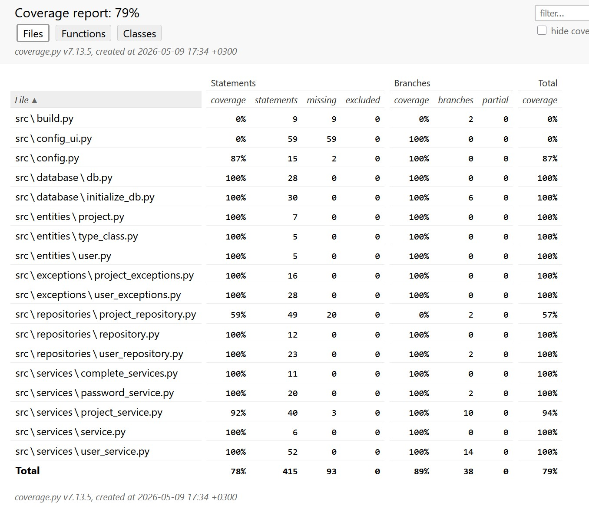

# Testaus

Sovelluksen toimintalogiikkaa on yksikkö ja integraatiotestattu unittesteillä sekä käyttöliittmymää manuaalisesti. Ohjelmaa on järjestelmätestattu `Unix` ja `Windows`-ympäristöissä. 

## Yksikkö ja integraatiotestaus

Yksikkötestit käyttävät **.env.test**-tiedostoa kokoonapnossaan.

### Sovelluslogiikka

Sovelluslogiikan eri luokat on testattu omilla testiluokillaan:
- ProjectService: TestProjectService
- PasswordService: TestPasswordService
- UserService: TestUserService
- ServiceBase: TestServiceBase
- Services: TestServices

### Varastoluokat

Varastoluokat on testattu omilla testiluokillaan:
- ProjectRepository: TestProjectRepository
- UserRepository: TestUserRepository
- RepositoryBase: TestRepositoryBase

### Tietokantaluokat

Tietokantaluokat on testattu omilla testiluokillan:
- DatabaseInterface: TestDatabaseInterface
- DatabaseInitializer: TestDatabaseInitializer

### Testikattavuus

Kokonaistestikattavuus on 79 % ja haarakattavuus 89 %.

## Järjestelmätestaus

Järjestelmätestauksessa kokoonpanoa on muutettu **.env**-tiedoston avulla. Ohjelmaa on ajettu `Windows 11:ssä` ja `Ubuntussa`.

Ohjelmaa on testattu ilman valmista tietokantaa ja sen kanssa. Kun tietokantaa ei vielä ole, sovellus luo sellaisen.

Kaikki [vaatimusmäärittelyasiakirjassa](dokumentaatio/vaatimusmaarittely.md) valmiiksi merkityt toiminnallisuudet on testattu käytännössä. Kenttiin on syötetty niin oikeita kuin virheellisiäkin arvoja, kuten liian lyhyitä käyttäjänimiä ja salasanoja käyttäjän luonnissa sekä maailmaa muokatessa tai luodessa nimikenttä on jätetty tyhjäksi.

## Testauksen puutteet

Tietokantaa ja sovellusta ei ole testattu suurilla määrillä tietokohteita.
