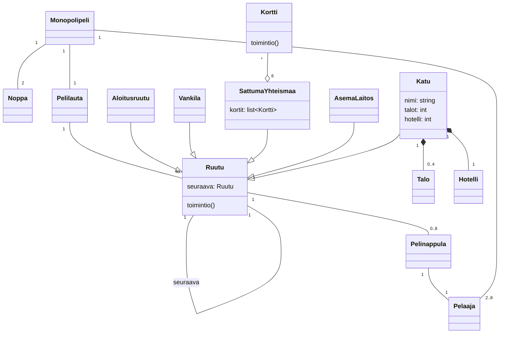

```mermaid
classDiagram
    Monopolipeli "1" -- "2" Noppa
    Monopolipeli "1" -- "1" Pelilauta
    Pelilauta "1" -- "40" Ruutu
    Ruutu "1" -- "1" Ruutu : seuraava
    Ruutu "1" -- "0..8" Pelinappula
    Pelinappula "1" -- "1" Pelaaja
    Pelaaja "2..8" -- "1" Monopolipeli
    Aloitusruutu --|> Ruutu
    Vankila --|> Ruutu
    SattumaYhteismaa --|> Ruutu
    AsemaLaitos --|> Ruutu
    Katu --|> Ruutu
    Kortti "*" --o "6" SattumaYhteismaa
    Katu "1" *-- "0..4" Talo
    Katu "1" *-- "1" Hotelli
    class Monopolipeli{
        
    }
    class Ruutu{
        seuraava: Ruutu
        toimintio()
    }
    class Katu{
        nimi: string
        talot: int
        hotelli: int
    }
    class SattumaYhteismaa{
        kortit: list~Kortti~
    }
    class Kortti{
        toimintio()
    }
```